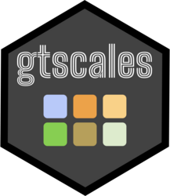
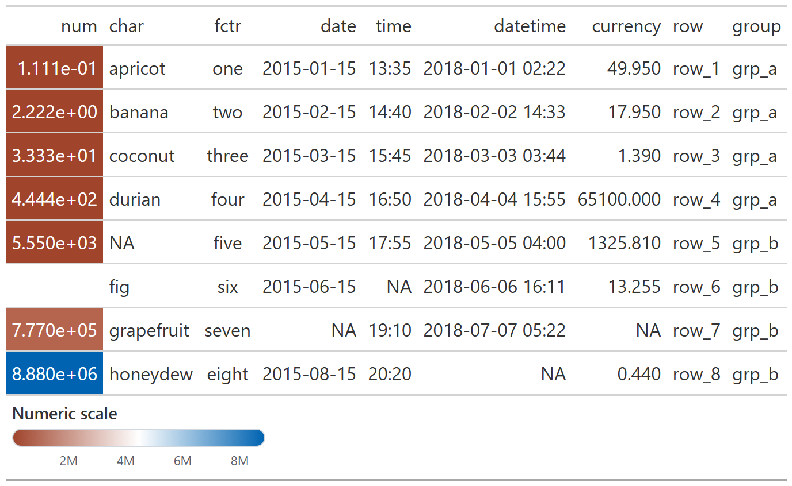
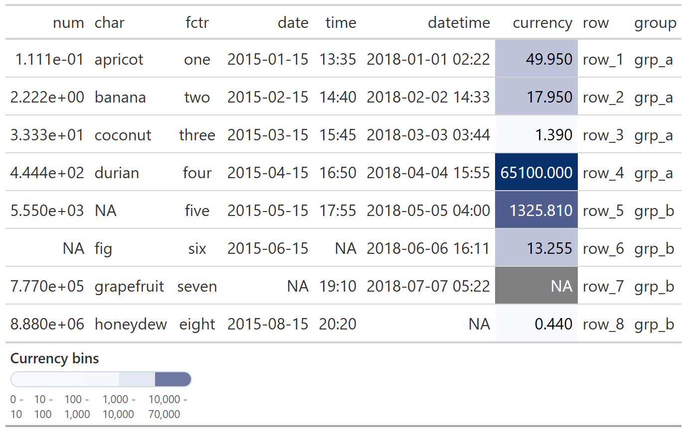
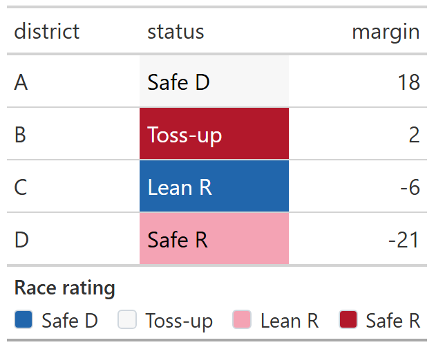
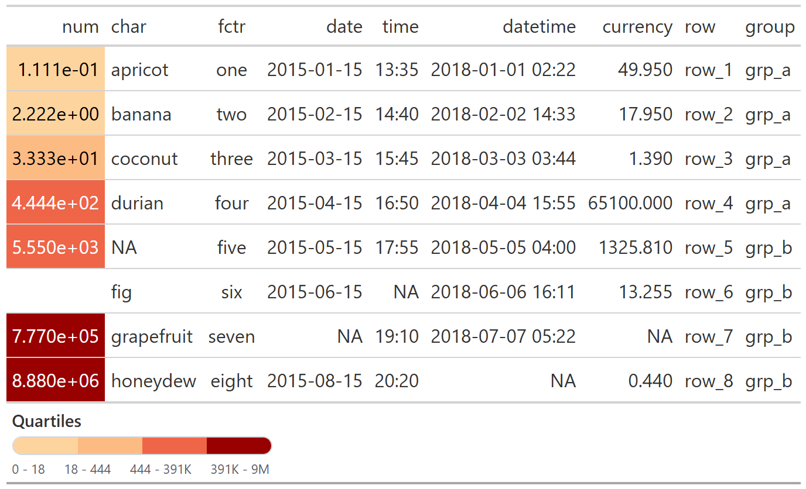

<!-- README.md is generated from README.Rmd. Please edit that file -->

```{r, include = FALSE}
knitr::opts_chunk$set(
  collapse = TRUE,
  comment = '#>',
  fig.path = 'man/figures/README-',
  out.width = '100%'
)

library(gt)
library(gtscales)

big_number_labels <- scales::label_number(scale_cut = scales::cut_short_scale())
date_labels <- scales::label_date('%b %d')
```

# gtscales <a href="https://christophertkenny.com/gtscales/"></a>

<!-- badges: start -->
[](https://github.com/christopherkenny/gtscales/actions/workflows/R-CMD-check.yaml)
[](https://app.codecov.io/gh/christopherkenny/gtscales)
<!-- badges: end -->

The goal of `gtscales` is to make color-encoded `gt` tables easier to read by adding matched legends directly to the rendered output.

## Installation

You can install the development version of gtscales from [GitHub](https://github.com/) with:

``` r
# install.packages("pak")
pak::pak("christopherkenny/gtscales")
```

## Examples

### Continuous

`gtscale_data_color_continuous()` colors the column and adds a matching gradient legend.

```{r continuous-code, eval = FALSE}
exibble |>
  gt() |>
  gtscale_data_color_continuous(
    column = num,
    palette = c('#A0442C', 'white', '#0063B1'),
    labels = big_number_labels,
    width = '220px',
    title = 'Numeric scale'
  )
```

```{r continuous-image, include = FALSE}
dir.create('man/figures', recursive = TRUE, showWarnings = FALSE)

exibble |>
  gt() |>
  gtscale_data_color_continuous(
    column = num,
    palette = c('#A0442C', 'white', '#0063B1'),
    labels = big_number_labels,
    width = '220px',
    title = 'Numeric scale'
  ) |>
  gt::gtsave(filename = 'man/figures/README-continuous.png')
```

```{r continuous-preview, echo = FALSE, out.width = "100%"}

```

### Bins

`gtscale_data_color_bins()` is useful when the color mapping is interval-based.

```{r bins-code, eval = FALSE}
exibble |>
  gt() |>
  gtscale_data_color_bins(
    column = currency,
    palette = c('#f7fbff', '#08306b'),
    bins = c(0, 10, 100, 1000, 10000, 70000),
    title = 'Currency bins'
  )
```

```{r bins-image, include = FALSE}
exibble |>
  gt() |>
  gtscale_data_color_bins(
    column = currency,
    palette = c('#f7fbff', '#08306b'),
    bins = c(0, 10, 100, 1000, 10000, 70000),
    title = 'Currency bins'
  ) |>
  gt::gtsave(filename = 'man/figures/README-bins.png')
```

```{r bins-preview, echo = FALSE, out.width = "100%"}

```

### Discrete

`gtscale_data_color_discrete()` is more useful when colors encode a compact status or class variable that benefits from a legend.

```{r discrete-code, eval = FALSE}
data.frame(
  district = c('A', 'B', 'C', 'D'),
  status = c('Safe D', 'Toss-up', 'Lean R', 'Safe R'),
  margin = c(18, 2, -6, -21)
) |>
  gt() |>
  gtscale_data_color_discrete(
    column = status,
    values = c('#2166ac', '#f7f7f7', '#f4a3b4', '#b2182b'),
    labels = c('Safe D', 'Toss-up', 'Lean R', 'Safe R'),
    title = 'Race rating'
  )
```

```{r discrete-image, include = FALSE}
data.frame(
  district = c('A', 'B', 'C', 'D'),
  status = c('Safe D', 'Toss-up', 'Lean R', 'Safe R'),
  margin = c(18, 2, -6, -21)
) |>
  gt() |>
  gtscale_data_color_discrete(
    column = status,
    values = c('#2166ac', '#f7f7f7', '#f4a3b4', '#b2182b'),
    labels = c('Safe D', 'Toss-up', 'Lean R', 'Safe R'),
    title = 'Race rating'
  ) |>
  gt::gtsave(filename = 'man/figures/README-discrete.png')
```

```{r discrete-preview, echo = FALSE, out.width = "100%"}

```

### Quantiles

`gtscale_data_color_quantiles()` is useful when you want evenly sized rank groups instead of fixed numeric cutpoints.

```{r quantile-code, eval = FALSE}
exibble |>
  gt() |>
  gtscale_data_color_quantiles(
    column = num,
    palette = c('#fdd49e', '#fdbb84', '#ef6548', '#990000'),
    quantiles = 4,
    labels = big_number_labels,
    width = '220px',
    title = 'Quartiles'
  )
```

```{r quantile-image, include = FALSE}
exibble |>
  gt() |>
  gtscale_data_color_quantiles(
    column = num,
    palette = c('#fdd49e', '#fdbb84', '#ef6548', '#990000'),
    quantiles = 4,
    labels = big_number_labels,
    width = '220px',
    title = 'Quartiles'
  ) |>
  gt::gtsave(filename = 'man/figures/README-quantiles.png')
```

```{r quantile-preview, echo = FALSE, out.width = "100%"}

```

## Working with scales

`gtscales` is designed to accept the same kinds of helpers you would already use with `scales`.

You can pass label functions, break functions, transform specifications, and palette functions directly.

```{r scales-code, eval = FALSE}
data.frame(
  when = as.Date(c('2024-01-01', '2024-01-20', '2024-02-10', '2024-03-05')),
  value = c(10, 18, 35, 52)
) |>
  gt() |>
  gtscale_data_color_bins(
    column = when,
    palette = scales::pal_viridis(),
    bins = scales::breaks_width('1 month'),
    labels = date_labels,
    width = '220px',
    title = 'Monthly bins'
  )

data.frame(value = c(1, 10, 100, 1000)) |>
  gt() |>
  gtscale_data_color_continuous(
    column = value,
    palette = scales::pal_viridis(),
    transform = 'log10',
    breaks = scales::breaks_log(),
    labels = big_number_labels,
    width = '220px'
  )
```
